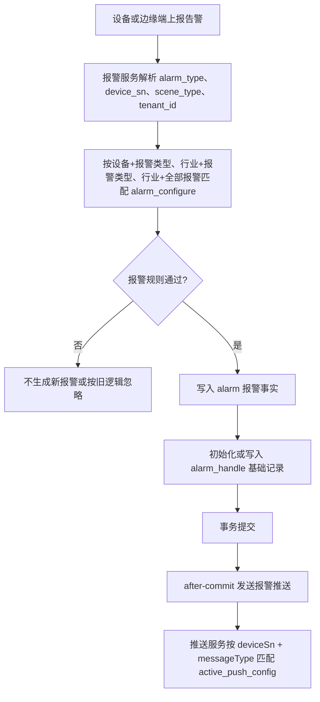
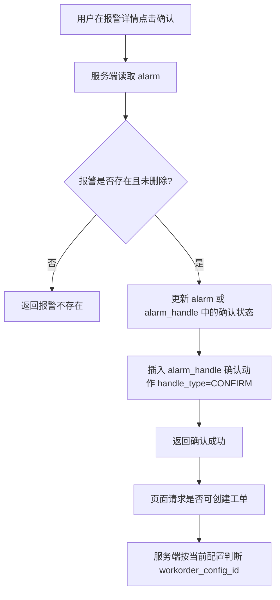
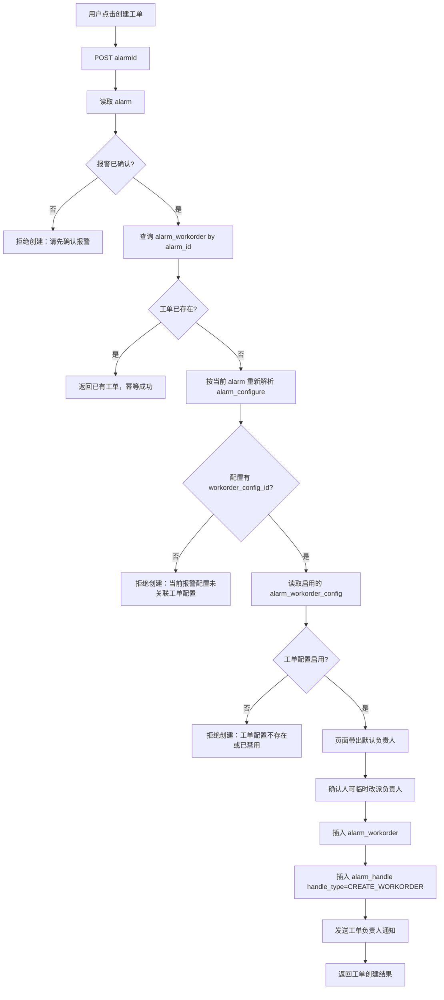
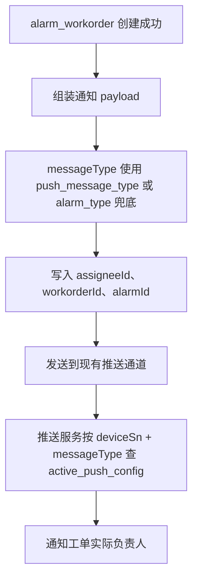

# 操作逻辑、字段使用与数据流转详细设计

本文用于在执行 `11-确认后人工创建工单实施计划.md` 之前，补齐业务操作逻辑、字段使用场景、数据流转和异常边界。

本文只记录详细设计，不修改 Java、XML、SQL 或配置文件。后续实现以 `10-最终设计口径确认.md`、`11-确认后人工创建工单实施计划.md` 和本文为准；早期文档中与本文冲突的字段口径，以本文修正后的口径为准。

## 1. 设计总原则

- `alarm` 只保存报警事实，不保存工单外键、不保存报警配置快照、不保存规则快照。
- `alarm_configure` 保存报警规则、推送细分和是否允许确认后创建工单。
- `alarm_handle` 保存报警动作时间线，包括确认、处理、创建工单、工单同步。
- `alarm_workorder` 保存工单事实，是工单列表和工单详情的唯一事实来源。
- 创建工单不是报警生成时自动触发，而是报警确认后由用户人工点击触发。
- 只有当前命中的报警配置存在 `workorder_config_id` 时，才允许创建工单。
- 一条报警最多一个工单实例，由 `alarm_workorder.alarm_id` 唯一约束保证。
- `push_message_type` 是推送策略编码，用于匹配推送配置；报警配置不直接绑定单个推送配置 ID。
- 推送绑定只用于通知报警确认人或工单负责人，不作为工单是否存在的判断来源。
- 报警通知可以命中多人，确认权限继续走报警管理现有权限。
- 工单模板提供默认负责人，创建工单时确认人可以临时改派，工单实例保存最终负责人。
- 工单关闭后必须写 `alarm_handle` 工单同步动作，表示本次人工处置已完成。

## 2. 用户操作主流程

### 2.1 配置入口顺序

用户可以从报警配置开始，不强制先配置工单。

推荐页面逻辑：

1. 用户新增或编辑报警配置。
2. 用户选择 `alarm_type`、适用设备或行业、报警规则和生效时间。
3. 用户填写 `push_message_type`，用于后续报警推送和工单负责人通知。
4. 如果该报警类型确认后需要创建工单，则选择已有 `workorder_config_id`。
5. 如果该报警类型不需要工单，则 `workorder_config_id` 留空。
6. 如果用户还没有工单配置，可以先保存无工单报警配置，后续创建工单配置后再回到报警配置绑定。

因此，报警配置是业务主入口；工单配置和推送配置是被报警配置引用的能力配置。

### 2.2 可选：配置工单配置

用户如需要某类报警确认后可以创建工单，需要先维护工单配置。

写入表：`alarm_workorder_config`

核心字段使用：

| 字段 | 写入方 | 后续读取方 | 用途 |
| --- | --- | --- | --- |
| `workorder_config_id` | 工单配置新增时生成 | `alarm_configure`、创建工单服务 | 被报警配置引用，创建工单时读取配置。 |
| `config_name` | 用户填写 | 配置列表、审计 | 展示配置名称。 |
| `enabled` | 用户设置 | 创建工单服务 | 只有启用的工单配置才允许创建工单。 |
| `workorder_type` | 用户设置 | 创建工单服务 | 创建工单时复制到 `alarm_workorder.workorder_type`。 |
| `workorder_priority` | 用户设置 | 创建工单服务 | 创建工单时复制到 `alarm_workorder.workorder_priority`。 |
| `assignee_type` | 用户设置 | 创建工单服务 | 表示负责人来源，如固定人员、角色、设备负责人。第一期可先支持固定人员。 |
| `assignee_id` | 用户设置或解析得到 | 创建工单服务、通知逻辑 | 创建工单负责人 ID，后续用于通知负责人。 |
| `assignee_name` | 用户设置或解析得到 | 页面、通知逻辑 | 创建工单负责人名称快照。 |
| `title_template` | 用户设置 | 创建工单服务 | 生成 `alarm_workorder.title`。 |
| `content_template` | 用户设置 | 创建工单服务 | 生成 `alarm_workorder.content`。 |
| `tenant_id` | 当前租户 | 查询和隔离 | 多租户隔离。 |
| `del_flag` | 系统维护 | 所有查询 | 过滤删除数据。 |

如果用户不需要工单能力，可以不创建工单配置，也不填写 `alarm_configure.workorder_config_id`。

### 2.3 核心：配置报警配置

用户维护报警配置时，需要确定报警类型、适用设备或行业、推送细分，以及是否允许确认后创建工单。

写入表：`alarm_configure`、`alarm_device_configure`、`alarm_configure_time`

核心字段使用：

| 字段 | 写入方 | 后续读取方 | 用途 |
| --- | --- | --- | --- |
| `alarm_configure_id` | 报警配置新增时生成 | 配置管理、关联表 | 配置主键。不会写入 `alarm`。 |
| `tenant_id` | 当前租户 | 配置解析、查询 | 多租户隔离。 |
| `scene_type` | 用户选择 | 配置解析 | 区分行业或业务场景。 |
| `alarm_type` | 用户选择 | 配置解析、报警规则判断 | 不同 `alarm_type` 可以有不同规则。为空或 `*` 可表达行业全部报警。 |
| `device_alarm_control` | 用户设置 | 配置解析 | 判断配置是否启用。 |
| `alarm_configure_period` | 用户设置 | 配置解析 | 判断是否需要按时间段生效。 |
| `repeat_cycle_number` | 用户设置 | 报警产生逻辑 | 重复报警抑制或周期判断。 |
| `push_message_type` | 用户设置 | 报警推送、工单通知 | 推送策略编码，对应推送服务 `active_push_config.message_type`；为空时回退 `alarm_type`。 |
| `workorder_config_id` | 用户选择或为空 | 创建工单服务 | 为空表示确认后也不允许创建工单；非空表示确认后可按配置创建工单。 |
| `del_flag` | 系统维护 | 配置解析、查询 | 过滤删除配置。 |

关联表字段使用：

| 表 | 字段 | 用途 |
| --- | --- | --- |
| `alarm_device_configure` | `alarm_configure_id` | 关联报警配置。 |
| `alarm_device_configure` | `device_sn` | 表达设备级配置命中范围。 |
| `alarm_configure_time` | `alarm_configure_id` | 关联报警配置。 |
| `alarm_configure_time` | 开始和结束时间字段 | 当配置启用时间段控制时，判断当前时间是否生效。 |

配置唯一性：

- 同一 `tenant_id + scene_type + device_sn + alarm_type` 下最多一个启用报警配置。
- 不同 `alarm_type` 可以绑定不同报警规则和不同 `workorder_config_id`。
- 行业级配置可以不绑定具体设备，但必须有明确的匹配优先级。

### 2.4 可选：配置推送配置

推送配置不决定报警是否生成，也不决定工单是否存在，只决定通知如何投递。

写入表：`active_push_config` 和推送配置设备绑定表

核心字段使用：

| 字段 | 写入方 | 后续读取方 | 用途 |
| --- | --- | --- | --- |
| `active_push_config_id` | 推送配置新增时生成 | 推送服务 Redis 路由 | 推送配置主键，也是合并去重依据。 |
| `message_type` | 用户设置 | 推送服务 | 与 `alarm_configure.push_message_type` 匹配。 |
| 启用状态字段 | 用户设置 | 推送服务 | 只投递启用的推送配置。 |
| `device_sn` | 用户绑定设备 | 推送服务 | 设备级路由匹配。 |

推送配置为空时：

- 报警和工单流程不应中断。
- 推送服务应记录无配置命中日志。
- 不应因为无推送配置导致工单重复创建或报警消费线程异常退出。

推送和权限边界：

- 推送配置决定“谁收到通知”。
- 报警管理权限决定“谁能确认报警”。
- 工单实例负责人决定“谁处理当前工单”。

## 3. 配置命中规则

报警生成、报警推送和确认后创建工单都会依赖报警配置解析，但读取目的不同。

### 3.1 报警生成时

报警生成时读取报警配置用于判断报警规则、重复周期、是否推送以及推送细分。

建议匹配顺序：

1. `tenant_id + scene_type + device_sn + alarm_type`
2. `tenant_id + scene_type + alarm_type`
3. `tenant_id + scene_type + alarm_type为空或*`

命中后只用于当前处理逻辑，不把 `alarm_configure_id` 或配置版本写入 `alarm`。

### 3.2 创建工单时

创建工单时重新按当前报警事实解析报警配置。

读取输入来自 `alarm`：

| `alarm` 字段 | 用途 |
| --- | --- |
| `alarm_id` | 创建工单入参和幂等键。 |
| `tenant_id` | 配置解析和工单租户隔离。 |
| `scene_type` | 配置解析。 |
| `device_sn` | 设备级配置解析。 |
| `alarm_type` | 报警类型配置解析。 |
| `alarm_rank` | 工单快照、优先级展示。 |
| `alarm_beginTime` | 工单报警时间快照。 |
| `alarm_handle` 或现有确认字段 | 判断报警是否已确认。 |

创建工单时不使用报警生成时的配置快照。含义是：用户点击创建工单时，以当前启用配置为准。

### 3.3 推送时

报警推送和工单通知都使用 `push_message_type` 作为推送策略编码。

字段映射：

| 报警配置字段 | 推送配置字段 | 用途 |
| --- | --- | --- |
| `alarm_configure.push_message_type` | `active_push_config.message_type` | 路由到对应推送配置。 |

兜底规则：

- 如果 `push_message_type` 有值，推送消息体使用它作为 `messageType`。
- 如果 `push_message_type` 为空，推送消息体回退使用 `alarm.alarm_type` 或旧系统默认报警类型。
- 推送服务按 `deviceSn + messageType` 或后续行业级路由找到已启用推送配置。
- 同一 `messageType` 可以命中多个推送配置或多个接收人。
- 推送接收人不等同于确认权限人；确认权限由报警管理权限控制。

## 4. 有工单配置与无工单配置的业务分支

### 4.1 未配置 `workorder_config_id`

适用场景：该类报警只需要通知和人工处理，不需要转工单。

流程：

1. 用户保存报警配置，`alarm_configure.workorder_config_id=NULL`。
2. 设备上报告警。
3. 报警服务命中报警配置，写入 `alarm`。
4. 报警服务按 `push_message_type` 发送报警通知。
5. 用户确认报警，写入 `alarm_handle` 确认动作。
6. 页面不展示创建工单按钮，或按钮置灰。
7. 用户仍可以直接处理报警。
8. 处理动作写入 `alarm_handle`。
9. 历史报警列表只展示 `alarm`。
10. 历史报警详情展示 `alarm_handle` 中的确认和处理动作，不展示工单绑定。

关键判断：

- 创建工单服务如果被直接调用，也必须重新解析当前配置。
- 如果解析到的配置没有 `workorder_config_id`，接口返回“不允许创建工单”。

### 4.2 已配置 `workorder_config_id`

适用场景：该类报警确认后允许人工创建工单。

流程：

1. 用户先维护启用的 `alarm_workorder_config`。
2. 用户保存报警配置，`alarm_configure.workorder_config_id` 指向该工单配置。
3. 设备上报告警。
4. 报警服务命中报警配置，写入 `alarm`。
5. 报警服务按 `push_message_type` 发送报警通知。
6. 用户确认报警，写入 `alarm_handle` 确认动作。
7. 页面根据服务端判断展示创建工单入口。
8. 用户点击创建工单。
9. 服务端校验报警已确认。
10. 服务端重新解析当前报警配置。
11. 服务端确认配置存在 `workorder_config_id`。
12. 服务端读取启用的 `alarm_workorder_config`。
13. 服务端检查 `alarm_workorder` 是否已存在该 `alarm_id` 的工单。
14. 创建工单页面默认带出 `alarm_workorder_config` 中的负责人。
15. 确认人可以临时改派负责人。
16. 不存在时创建 `alarm_workorder`。
17. 创建成功后插入 `alarm_handle` 创建工单动作，写入 `workorder_id`。
18. 创建成功后发送工单负责人通知。
19. 后续工单处理更新 `alarm_workorder`，工单关闭后必须同步动作到 `alarm_handle`。

关键判断：

- 未确认报警不能创建工单。
- 已存在工单时，重复点击不创建第二张工单，返回已存在的工单信息。
- 推送失败不应影响工单事实是否存在，第一期实现如果仍在事务内推送，需要在风险中记录后续改为 after-commit。

## 5. 报警生成数据流

报警生成写入字段：

| 表 | 字段 | 写入内容 |
| --- | --- | --- |
| `alarm` | `alarm_id` | 报警 ID。 |
| `alarm` | `tenant_id` | 租户。 |
| `alarm` | `scene_type` | 行业或场景。 |
| `alarm` | `device_sn` | 设备 SN。 |
| `alarm` | `alarm_type` | 报警类型。 |
| `alarm` | `alarm_rank` | 报警等级。 |
| `alarm` | `alarm_status` | 初始报警事实状态。 |
| `alarm` | `alarm_beginTime` | 报警开始时间，也是分片路由关键字段。 |
| `alarm` | `alarm_endTime` | 报警结束时间，生成时通常为空。 |
| `alarm_handle` | `alarm_id` | 关联报警。 |
| `alarm_handle` | `alarm_beginTime` | 分片路由和详情时间线排序。 |
| `alarm_handle` | `handle_type` | 初始记录可为空或按兼容逻辑处理；确认、处理、创建工单动作必须明确写入。 |

报警生成不写入：

| 不写入字段 | 原因 |
| --- | --- |
| `alarm.alarm_configure_id` | 最终口径不保存配置来源，创建工单按点击时当前配置判断。 |
| `alarm.config_version` | 最终口径不保存配置版本。 |
| `alarm.workorder_id` | 工单绑定放在 `alarm_handle.workorder_id` 和 `alarm_workorder.alarm_id`。 |
| `alarm.rule_snapshot_json` | 本轮不做规则快照。 |
| `alarm.raw_payload_json` | 本轮不保存原始报文。 |

## 6. 报警确认数据流

确认动作字段使用：

| 表 | 字段 | 使用方式 |
| --- | --- | --- |
| `alarm` | `alarm_id` | 确认入参。 |
| `alarm_handle` 或现有确认字段 | 确认信息 | 更新或判断报警确认状态。 |
| `alarm_handle` | `alarm_id` | 关联报警。 |
| `alarm_handle` | `handle_type` | 写入 `CONFIRM`。 |
| `alarm_handle` | `confirm_user_id` | 写入确认人。 |
| `alarm_handle` | `handle_time` | 写入确认时间或动作时间。 |
| `alarm_handle` | `status_before` | 记录确认前报警状态。 |
| `alarm_handle` | `status_after` | 记录确认后报警状态。 |

确认后的页面判断：

| 条件 | 页面行为 |
| --- | --- |
| 报警未确认 | 不展示创建工单入口，或提示先确认。 |
| 报警已确认，当前配置无 `workorder_config_id` | 不展示创建工单入口，或按钮置灰并提示未配置工单。 |
| 报警已确认，当前配置有 `workorder_config_id`，且无工单 | 展示创建工单入口。 |
| 报警已确认，已有工单 | 展示工单信息入口，不再展示重复创建入口。 |

## 7. 创建工单数据流

创建工单读取字段：

| 表 | 字段 | 用途 |
| --- | --- | --- |
| `alarm` | `alarm_id` | 创建工单入参和唯一幂等键。 |
| `alarm` | `tenant_id` | 解析配置、创建工单租户字段。 |
| `alarm` | `scene_type` | 解析报警配置。 |
| `alarm` | `device_sn` | 解析设备级配置，写入工单快照。 |
| `alarm` | `alarm_type` | 解析不同报警类型规则，写入工单快照。 |
| `alarm` | `alarm_rank` | 写入工单报警等级快照。 |
| `alarm` | `alarm_beginTime` | 写入工单报警时间快照。 |
| `alarm_handle` 或现有确认字段 | 确认信息 | 判断报警是否已确认。 |
| `alarm_configure` | `push_message_type` | 工单负责人通知的消息类型。 |
| `alarm_configure` | `workorder_config_id` | 判断是否允许创建工单，并读取工单配置。 |
| `alarm_workorder_config` | `enabled` | 判断工单配置是否可用。 |
| `alarm_workorder_config` | `workorder_type` | 复制到工单实例。 |
| `alarm_workorder_config` | `workorder_priority` | 复制到工单实例。 |
| `alarm_workorder_config` | `assignee_id` | 作为默认负责人带出。 |
| `alarm_workorder_config` | `assignee_name` | 作为默认负责人名称带出。 |
| `alarm_workorder_config` | `title_template` | 渲染工单标题。 |
| `alarm_workorder_config` | `content_template` | 渲染工单内容。 |

创建工单写入字段：

| 表 | 字段 | 写入内容 |
| --- | --- | --- |
| `alarm_workorder` | `workorder_id` | 工单 ID。 |
| `alarm_workorder` | `workorder_no` | 工单编号。 |
| `alarm_workorder` | `alarm_id` | 关联报警 ID，唯一。 |
| `alarm_workorder` | `workorder_config_id` | 当前使用的工单配置 ID。 |
| `alarm_workorder` | `workorder_type` | 从工单配置复制。 |
| `alarm_workorder` | `workorder_priority` | 从工单配置复制。 |
| `alarm_workorder` | `title` | 根据模板和报警事实生成。 |
| `alarm_workorder` | `content` | 根据模板和报警事实生成。 |
| `alarm_workorder` | `device_sn` | 从报警复制，作为快照。 |
| `alarm_workorder` | `alarm_type` | 从报警复制，作为快照。 |
| `alarm_workorder` | `alarm_rank` | 从报警复制，作为快照。 |
| `alarm_workorder` | `alarm_time` | 从 `alarm.alarm_beginTime` 复制。 |
| `alarm_workorder` | `assignee_id` | 本次工单实际负责人 ID，可能来自模板，也可能由确认人改派。 |
| `alarm_workorder` | `assignee_name` | 本次工单实际负责人名称快照。 |
| `alarm_workorder` | `status` | 初始状态，如待接单。 |
| `alarm_workorder` | `tenant_id` | 从报警复制。 |
| `alarm_workorder` | `del_flag` | 默认有效。 |
| `alarm_handle` | `handle_type` | 写入 `CREATE_WORKORDER`。 |
| `alarm_handle` | `workorder_id` | 写入新工单 ID。 |
| `alarm_handle` | `alarm_id` | 关联当前报警。 |
| `alarm_handle` | `status_before` | 创建工单前处理状态或工单状态，可按现有状态口径记录。 |
| `alarm_handle` | `status_after` | 创建工单后处理状态或工单状态，可按现有状态口径记录。 |

## 8. 工单负责人通知数据流

工单负责人通知发生在工单创建成功之后。

通知不是工单事实来源。工单是否存在只能看 `alarm_workorder`。

通知 payload 建议字段：

| 字段 | 来源 | 用途 |
| --- | --- | --- |
| `eventType` | 固定值 `WORKORDER_CREATED` | 区分工单创建通知和普通报警通知。 |
| `tenantId` | `alarm.tenant_id` | 租户隔离。 |
| `deviceSn` | `alarm.device_sn` | 推送路由。 |
| `messageType` | `alarm_configure.push_message_type`，为空回退 `alarm.alarm_type` | 匹配推送配置。 |
| `alarmId` | `alarm.alarm_id` | 前端打开报警详情。 |
| `workorderId` | `alarm_workorder.workorder_id` | 前端打开工单详情。 |
| `workorderNo` | `alarm_workorder.workorder_no` | 展示工单编号。 |
| `assigneeId` | `alarm_workorder.assignee_id` | 目标负责人。 |
| `assigneeName` | `alarm_workorder.assignee_name` | 展示负责人。 |

推送失败处理：

- 第一优先级是不能因为通知失败生成重复工单。
- 如果推送失败发生在 DB 提交后，应记录日志并允许后续补偿。
- 如果第一期实现暂时放在事务内，需要明确风险：推送异常可能导致工单事务回滚。后续应改为 after-commit 或本地消息表。

## 9. 报警处理与工单处理边界

### 9.1 没有工单的报警

- 可以确认。
- 可以直接处理。
- 可以关闭或误报。
- `alarm_handle` 记录确认和处理动作，其中直接处理写 `handle_type=HANDLE`，表示本次人工处置闭环。
- `alarm_workorder` 没有记录。
- 历史报警详情不展示工单绑定。

### 9.2 有工单的报警

- 报警侧不再重复执行直接处理完成动作，处理主链路交给工单。
- 工单状态只由 `alarm_workorder.status` 表达。
- 工单处理结果写 `alarm_workorder.handle_result`。
- 工单关闭后必须写 `alarm_handle` 工单同步动作，用于报警详情展示本次人工处置完成。
- 工单转派不创建第二条 `alarm_workorder`，只更新当前工单负责人，并写动作记录。
- 工单关闭不保证异常永久消失；后续仍异常时由重复报警或新报警重新进入流程。

字段边界：

| 行为 | 事实表 | 时间线表 |
| --- | --- | --- |
| 确认报警 | `alarm` 或现有确认字段 | `alarm_handle.handle_type=CONFIRM` |
| 直接处理报警 | `alarm_handle` | `alarm_handle.handle_type=HANDLE` |
| 创建工单 | `alarm_workorder` | `alarm_handle.handle_type=CREATE_WORKORDER` |
| 工单关闭同步 | `alarm_workorder` | 必须写 `alarm_handle.handle_type=WORKORDER_SYNC` 或等价动作 |
| 工单转派 | `alarm_workorder.assignee_id/name` | 可选写 `alarm_handle.handle_type=WORKORDER_SYNC` |

## 10. 查询数据流

### 10.1 历史报警列表

只查 `alarm`。

不关联：

- `alarm_handle`
- `alarm_workorder`
- `alarm_configure`

原因：

- 列表强调报警事实。
- 避免历史查询被工单和处理流水拖慢。
- 避免由于工单配置变动影响历史报警列表。

### 10.2 历史报警详情

以 `alarm` 为主，关联或追加查询 `alarm_handle`。

详情展示逻辑：

1. 查询 `alarm` 基础事实。
2. 查询 `alarm_handle` 时间线。
3. 如果时间线中存在 `workorder_id`，再查询对应 `alarm_workorder`。
4. 页面展示确认、处理、创建工单和工单同步记录。

### 10.3 工单列表和工单详情

只以 `alarm_workorder` 为主。

可选扩展：

- 工单详情可以通过 `alarm_id` 查询报警摘要。
- 但工单状态、负责人、处理结果必须以 `alarm_workorder` 为准。

## 11. 状态和幂等设计

### 11.1 创建工单幂等

幂等键：`alarm_workorder.alarm_id`

策略：

1. 创建前先查 `alarm_workorder`。
2. 不存在时插入。
3. 并发插入时依赖唯一键 `uk_alarm_workorder_alarm`。
4. 捕获唯一键冲突后再查一次，查到则返回已存在工单。

### 11.2 状态判断

创建工单前必须判断报警已确认。

建议服务端判断，而不是只依赖前端按钮：

| 判断项 | 数据来源 | 不满足时 |
| --- | --- | --- |
| 报警存在 | `alarm` | 返回报警不存在。 |
| 报警已确认 | `alarm_handle` 或现有确认字段 | 返回请先确认报警。 |
| 当前配置存在 | `alarm_configure` | 返回未命中启用报警配置。 |
| 配置有关联工单 | `alarm_configure.workorder_config_id` | 返回当前报警配置未关联工单配置。 |
| 工单配置启用 | `alarm_workorder_config.enabled` | 返回工单配置不存在或已禁用。 |
| 工单未存在 | `alarm_workorder.alarm_id` | 返回已存在工单。 |

## 12. 字段使用总表

### 12.1 `alarm`

| 字段 | 本设计用途 |
| --- | --- |
| `alarm_id` | 报警主键，创建工单入参，工单唯一关联键。 |
| `tenant_id` | 配置解析、推送、工单租户隔离。 |
| `scene_type` | 配置解析。 |
| `device_sn` | 配置解析、推送路由、工单快照。 |
| `alarm_type` | 报警类型规则解析、推送兜底类型、工单快照。 |
| `alarm_rank` | 报警等级展示、工单快照。 |
| `alarm_status` | 报警事实状态，不承载确认、处理、已转工单等业务处理状态。 |
| `alarm_beginTime` | 报警开始时间、分片路由、工单报警时间快照。 |
| `alarm_endTime` | 报警结束时间，不承载工单完成时间。 |

不新增也不使用：

- `alarm_configure_id`
- `config_version`
- `device_type`
- `alarm_title`
- `alarm_content`
- `workorder_id`
- `rule_snapshot_json`
- `raw_payload_json`

### 12.2 `alarm_configure`

| 字段 | 本设计用途 |
| --- | --- |
| `alarm_configure_id` | 配置主键，只在配置域内使用，不写入 `alarm`。 |
| `tenant_id` | 配置解析隔离。 |
| `scene_type` | 配置解析维度。 |
| `alarm_type` | 区分不同报警类型规则。为空或 `*` 表示行业全部报警。 |
| `device_alarm_control` | 是否启用报警控制。 |
| `repeat_cycle_number` | 重复报警规则。 |
| `push_message_type` | 推送策略编码，映射 `active_push_config.message_type`。 |
| `workorder_config_id` | 确认后是否允许创建工单的核心字段。 |
| `del_flag` | 过滤删除配置。 |

### 12.3 `alarm_handle`

| 字段 | 本设计用途 |
| --- | --- |
| `alarm_handle_id` | 动作记录主键。 |
| `alarm_id` | 关联报警。 |
| `alarm_beginTime` | 分片路由和时间线查询。 |
| `handle_type` | 区分确认、处理、创建工单、工单同步等动作。 |
| `workorder_id` | 创建工单或工单同步动作关联的工单 ID。 |
| `confirm_user_id` | 确认人。 |
| `handler_id` | 处理人。 |
| `handler_name` | 处理人名称。 |
| `handle_time` | 动作发生时间。 |
| `handle_status` | 兼容现有处理状态字段。 |
| `status_before` | 动作前报警状态。 |
| `status_after` | 动作后报警状态。 |
| `handle_opinion` | 处理意见。 |
| `handle_img` | 处理图片或附件。 |

### 12.4 `alarm_workorder_config`

| 字段 | 本设计用途 |
| --- | --- |
| `workorder_config_id` | 被 `alarm_configure.workorder_config_id` 引用。 |
| `config_name` | 配置名称。 |
| `enabled` | 是否启用。 |
| `workorder_type` | 工单类型模板。 |
| `workorder_priority` | 工单优先级模板。 |
| `assignee_type` | 派单方式。 |
| `assignee_id` | 模板默认负责人 ID。 |
| `assignee_name` | 模板默认负责人名称快照。 |
| `title_template` | 工单标题模板。 |
| `content_template` | 工单内容模板。 |
| `tenant_id` | 租户隔离。 |
| `del_flag` | 过滤删除配置。 |

### 12.5 `alarm_workorder`

| 字段 | 本设计用途 |
| --- | --- |
| `workorder_id` | 工单主键。 |
| `workorder_no` | 工单编号。 |
| `alarm_id` | 关联报警，必须唯一。 |
| `workorder_config_id` | 创建时使用的工单配置 ID。 |
| `workorder_type` | 工单类型快照。 |
| `workorder_priority` | 工单优先级快照。 |
| `title` | 工单标题。 |
| `content` | 工单内容。 |
| `device_sn` | 报警设备 SN 快照。 |
| `alarm_type` | 报警类型快照。 |
| `alarm_rank` | 报警等级快照。 |
| `alarm_time` | 报警开始时间快照。 |
| `assignee_id` | 当前工单实际负责人 ID。 |
| `assignee_name` | 当前工单实际负责人名称。 |
| `status` | 工单状态。 |
| `handle_result` | 工单处理结果。 |
| `tenant_id` | 租户隔离。 |
| `del_flag` | 逻辑删除。 |

### 12.6 `active_push_config`

| 字段 | 本设计用途 |
| --- | --- |
| `active_push_config_id` | 推送配置主键，去重依据。 |
| `message_type` | 与 `alarm_configure.push_message_type` 匹配。 |
| 启用状态字段 | 只查启用推送配置。 |
| 租户或行业字段 | 行业级路由增强时使用。 |

## 13. 风险边界

| 风险 | 说明 | 当前设计处理 |
| --- | --- | --- |
| 配置漂移 | 报警生成后配置可能变化，创建工单按点击时当前配置判断。 | 明确语义；工单实例保存 `workorder_config_id`。 |
| 重复创建工单 | 用户重复点击或接口重试。 | `alarm_workorder.alarm_id` 唯一约束和服务幂等。 |
| 推送失败 | 工单创建后通知负责人失败。 | 工单事实不依赖推送；后续建议 after-commit 或补偿。 |
| 工单和报警侧双入口冲突 | 已创建工单后，如果报警侧仍直接处理完成，会与工单状态冲突。 | 已创建工单后以工单闭环为主，工单关闭后同步写 `alarm_handle`。 |
| 处理流水覆盖 | 旧逻辑按 `alarm_id` 更新 `alarm_handle`。 | 新增动作必须 insert 流水；旧更新逻辑只做兼容。 |
| 分片缺字段 | `alarm_handle` 是分片链路。 | 同步基础表、物理表、建表逻辑、Mapper。 |
| 历史列表性能下降 | 关联工单和处理流水会拖慢列表。 | 历史列表只查 `alarm`。 |

## 14. 实现前确认清单

- 确认页面创建工单入口只在报警确认后出现。
- 确认服务端创建工单接口会重新校验报警已确认。
- 确认 `alarm_configure.workorder_config_id` 为空时不能创建工单。
- 确认 `alarm_workorder.alarm_id` 建唯一键。
- 确认 `alarm_handle` 新动作使用 insert，不覆盖旧动作。
- 确认历史报警列表只查 `alarm`。
- 确认历史报警详情会查询 `alarm_handle` 时间线。
- 确认工单列表和详情以 `alarm_workorder` 为事实来源。
- 确认推送失败不会导致重复工单。
- 确认本轮不新增 `alarm.workorder_id`、`alarm.alarm_configure_id`、`alarm.config_version`。
- 确认创建工单时页面默认带出模板负责人，并允许确认人临时改派。
- 确认工单关闭后会写入 `alarm_handle` 工单同步动作。
