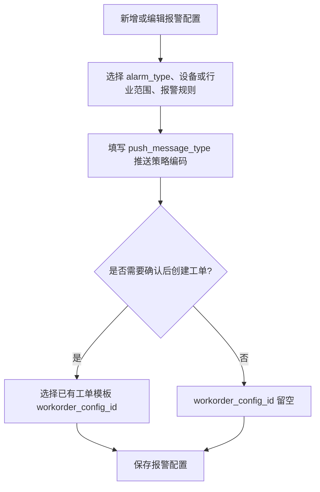
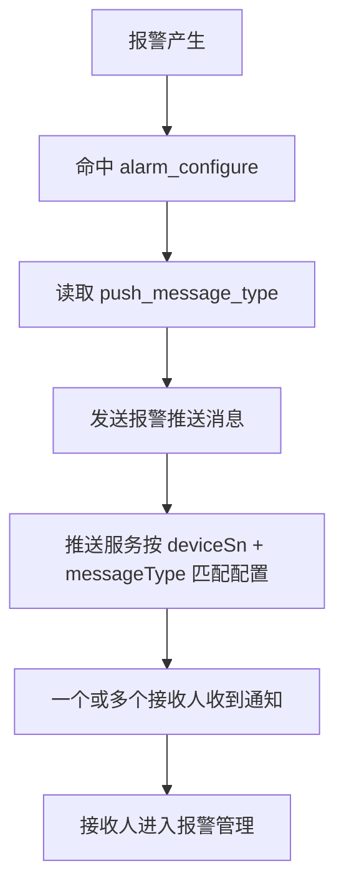
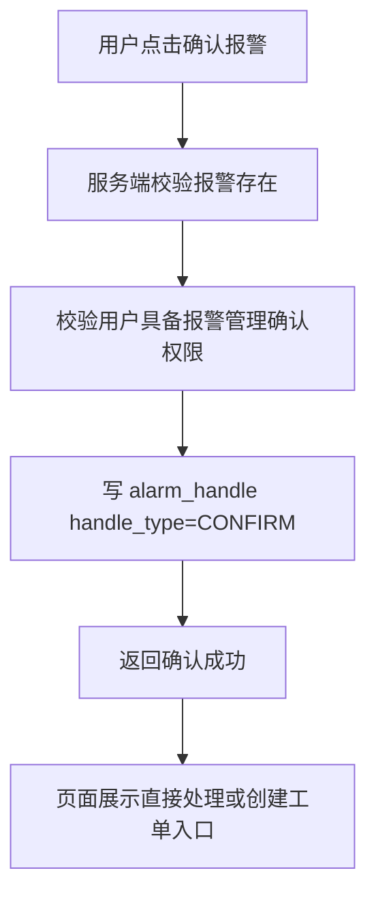
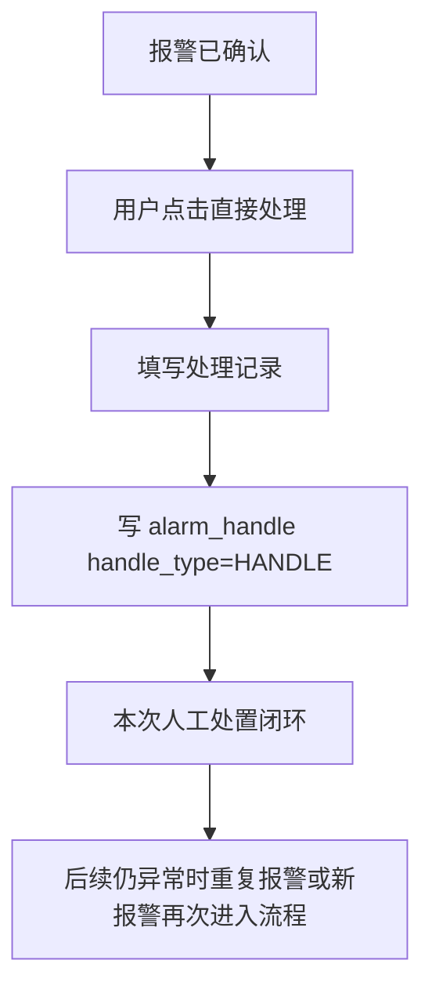
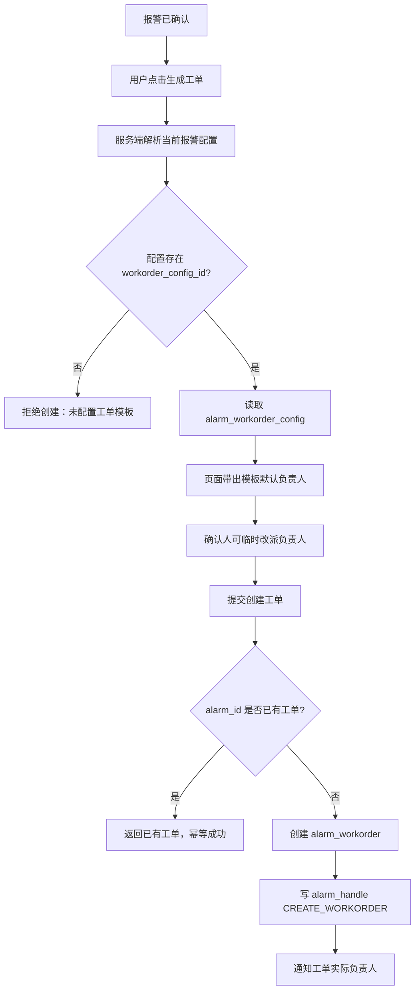
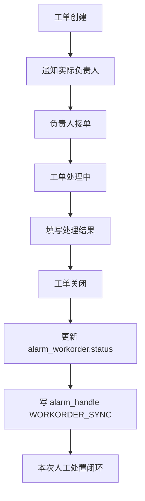
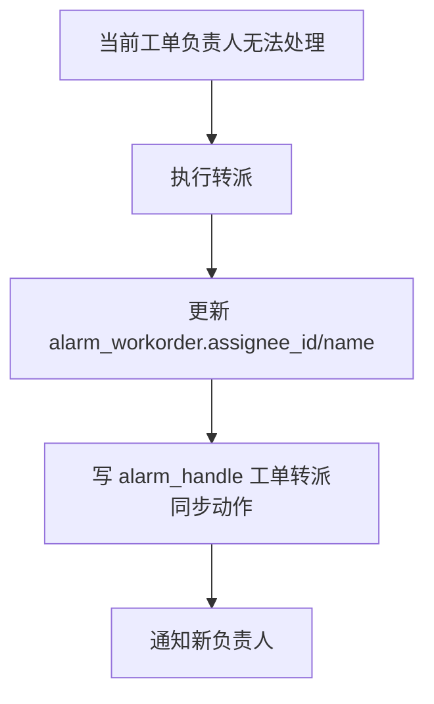

# 报警确认工单闭环详细设计方案

本文是在执行代码实现计划前，对报警配置、报警推送、报警确认、直接处理、工单创建、工单处理和报警详情展示的最终详细设计。

本文只记录设计方案，不修改 Java、XML、SQL 或配置文件。后续如更新 `11-确认后人工创建工单实施计划.md`，应以本文为输入。

## 1. 设计目标

本设计要满足以下业务链路：

```text
报警配置
  -> 绑定 push_message_type 推送策略编码
  -> 可选绑定 workorder_config_id 工单模板

报警产生
  -> 写 alarm
  -> 按 push_message_type 推送给一个或多个报警通知人

报警通知人
  -> 进入报警管理
  -> 权限继续走报警管理现有权限
  -> 有权限的人确认报警

确认后
  -> 可以直接处理
  -> 也可以点击生成工单

工单生成后
  -> 使用工单模板默认负责人
  -> 确认人可以临时改派负责人
  -> 创建工单并通知实际负责人

工单关闭后
  -> 写工单处理结果
  -> 同步写 alarm_handle
  -> 本次人工处置闭环

后续仍异常
  -> 通过重复报警或新报警再次进入流程
```

## 2. 核心定位

### 2.1 alarm

`alarm` 只保存报警事实和报警生命周期。

它回答的问题是：发生了什么报警、发生在哪个设备、何时开始、何时结束。

本轮不把以下业务处理信息放入 `alarm`：

- 确认状态。
- 处理中状态。
- 已转工单状态。
- 工单处理完成状态。
- 工单 ID。
- 报警配置 ID。
- 配置版本。
- 规则快照。

### 2.2 alarm_handle

`alarm_handle` 是报警侧动作时间线。

它回答的问题是：这个报警发生后，报警侧发生过哪些动作。

本轮至少承载：

- 报警确认。
- 直接处理。
- 创建工单。
- 工单转派同步。
- 工单关闭同步。

### 2.3 alarm_workorder

`alarm_workorder` 是跨人协作任务。

它回答的问题是：这件事派给谁处理、处理到什么状态、处理结果是什么。

工单不是每条报警必有。简单报警可以直接写 `alarm_handle` 完成处理；需要派给他人或纳入任务管理时，才创建工单。

### 2.4 alarm_configure

`alarm_configure` 是报警配置主表。

本轮只把两个能力开关放在报警配置上：

| 字段 | 定位 |
| --- | --- |
| `push_message_type` | 推送策略编码，用于匹配推送配置。 |
| `workorder_config_id` | 工单模板引用，为空表示确认后不能按模板创建工单。 |

报警配置不直接绑定 `active_push_config_id`，避免和单个推送配置强耦合。

### 2.5 alarm_workorder_config

`alarm_workorder_config` 是工单模板。

它提供默认工单信息：

- 默认负责人。
- 默认标题模板。
- 默认内容模板。
- 默认工单类型。
- 默认优先级。

创建工单时可以使用模板默认负责人，也允许确认人临时改派。最终负责人以 `alarm_workorder.assignee_id` 和 `alarm_workorder.assignee_name` 为准。

## 3. 用户操作流程

### 3.1 配置阶段

用户从报警配置进入。



配置规则：

- `push_message_type` 用于通知报警确认人和工单负责人。
- `workorder_config_id` 只表示确认后是否允许按模板创建工单。
- 没有工单模板时，可以先保存无工单报警配置，后续再回填 `workorder_config_id`。

### 3.2 报警通知阶段

报警产生后，报警服务按命中的报警配置发送推送。



权限边界：

- 推送配置决定谁收到通知。
- 报警管理权限决定谁能确认报警。
- 收到通知但没有权限的人不能绕过报警管理权限确认报警。

### 3.3 报警确认阶段

有报警管理权限的人进入报警详情后确认报警。



确认动作写入：

| 表 | 字段 | 写入内容 |
| --- | --- | --- |
| `alarm_handle` | `alarm_id` | 当前报警 ID。 |
| `alarm_handle` | `handle_type` | `CONFIRM`。 |
| `alarm_handle` | `confirm_user_id` | 确认人 ID。 |
| `alarm_handle` | `handler_name` | 确认人名称，按现有字段兼容。 |
| `alarm_handle` | `handle_time` | 确认时间。 |
| `alarm_handle` | `alarm_beginTime` | 报警开始时间，用于分片路由。 |

## 4. 确认后的两条处理分支

### 4.1 分支 A：不生成工单，直接处理

适用场景：

- 确认人可以自己处理。
- 报警较简单，不需要派给其他运维人员。
- 报警配置没有 `workorder_config_id`。
- 虽然有工单模板，但确认人判断不需要工单。

流程：



直接处理写入：

| 表 | 字段 | 写入内容 |
| --- | --- | --- |
| `alarm_handle` | `alarm_id` | 当前报警 ID。 |
| `alarm_handle` | `handle_type` | `HANDLE`。 |
| `alarm_handle` | `handler_id` | 处理人 ID。 |
| `alarm_handle` | `handler_name` | 处理人名称。 |
| `alarm_handle` | `handle_opinion` | 处理说明。 |
| `alarm_handle` | `handle_img` | 处理图片或附件。 |
| `alarm_handle` | `handle_time` | 处理时间。 |

直接处理的语义：

- 表示本次人工处置完成。
- 不创建 `alarm_workorder`。
- 不把处理完成状态写入 `alarm`。
- 如果后续同一位置再次异常，依赖重复报警或新报警再次处理。

### 4.2 分支 B：点击生成工单

适用场景：

- 确认人需要把处理任务派给其他人。
- 需要进入工单列表、我的任务、派单、接单、处理、关闭流程。
- 当前报警配置存在 `workorder_config_id`。

流程：



创建工单前置条件：

| 条件 | 不满足时处理 |
| --- | --- |
| 报警存在 | 返回报警不存在。 |
| 报警已确认 | 返回请先确认报警。 |
| 当前用户具备报警管理确认相关权限 | 返回无权限。 |
| 当前报警配置存在 `workorder_config_id` | 返回当前报警配置未绑定工单模板。 |
| 工单模板启用 | 返回工单模板不存在或已禁用。 |
| `alarm_workorder.alarm_id` 不存在 | 已存在则返回已有工单。 |

## 5. 工单负责人设计

### 5.1 默认负责人和实际负责人

| 字段 | 含义 |
| --- | --- |
| `alarm_workorder_config.assignee_id` | 模板默认负责人 ID。 |
| `alarm_workorder_config.assignee_name` | 模板默认负责人名称。 |
| `alarm_workorder.assignee_id` | 本次工单实际负责人 ID。 |
| `alarm_workorder.assignee_name` | 本次工单实际负责人名称。 |

创建工单页面行为：

1. 根据 `workorder_config_id` 读取模板。
2. 默认带出模板负责人。
3. 确认人可以改派给其他人。
4. 提交后，以页面最终选择的人写入 `alarm_workorder.assignee_id/name`。

### 5.2 创建人

不新增 `creator_id` 或 `creator_name` 字段。

创建人记录方式：

| 位置 | 用途 |
| --- | --- |
| `alarm_workorder.create_by` | 记录点击生成工单的人。 |
| `alarm_handle` 的 `CREATE_WORKORDER` 动作 | 记录创建工单动作，便于报警详情时间线展示。 |

## 6. 工单处理和关闭

工单创建后，处理主链路交给工单。



工单关闭写入：

| 表 | 字段 | 写入内容 |
| --- | --- | --- |
| `alarm_workorder` | `status` | 关闭或已处理状态。 |
| `alarm_workorder` | `handle_result` | 工单处理结果。 |
| `alarm_workorder` | `update_time` | 更新时间。 |
| `alarm_handle` | `alarm_id` | 当前报警 ID。 |
| `alarm_handle` | `handle_type` | `WORKORDER_SYNC` 或等价工单同步动作。 |
| `alarm_handle` | `workorder_id` | 当前工单 ID。 |
| `alarm_handle` | `handle_opinion` | 工单处理结果摘要。 |
| `alarm_handle` | `handler_id` | 工单处理人或关闭人 ID。 |
| `alarm_handle` | `handler_name` | 工单处理人或关闭人名称。 |
| `alarm_handle` | `handle_time` | 工单关闭同步时间。 |

工单关闭语义：

- 表示本次人工处置完成。
- 不保证异常永久消失。
- 不直接要求修改 `alarm.alarm_endTime`。
- 后续仍异常时，依赖重复报警或新报警再次进入流程。

## 7. 工单转派

一条报警最多一个工单，禁止重复创建工单。

需要换人处理时，不新增第二张工单，而是转派当前工单。



转派写入：

| 表 | 字段 | 写入内容 |
| --- | --- | --- |
| `alarm_workorder` | `assignee_id` | 新负责人 ID。 |
| `alarm_workorder` | `assignee_name` | 新负责人名称。 |
| `alarm_handle` | `handle_type` | `WORKORDER_SYNC` 或后续扩展的转派动作。 |
| `alarm_handle` | `workorder_id` | 当前工单 ID。 |
| `alarm_handle` | `handle_opinion` | 转派说明。 |

## 8. 查询设计

### 8.1 历史报警列表

只查 `alarm`。

不关联：

- `alarm_handle`
- `alarm_workorder`
- `alarm_configure`

列表只展示报警事实，避免被处理流水和工单拖慢。

### 8.2 报警详情

以 `alarm` 为主，追加查询 `alarm_handle` 时间线。

展示内容：

- 报警事实。
- 确认记录。
- 直接处理记录。
- 创建工单记录。
- 工单转派同步记录。
- 工单关闭同步记录。

如果时间线里存在 `workorder_id`，再查 `alarm_workorder` 展示工单摘要。

### 8.3 工单列表和详情

以 `alarm_workorder` 为事实来源。

工单详情可以通过 `alarm_id` 查询报警摘要，但工单状态、负责人、处理结果必须以 `alarm_workorder` 为准。

## 9. 字段使用总览

### 9.1 `alarm`

| 字段 | 使用方式 |
| --- | --- |
| `alarm_id` | 报警主键，工单唯一关联键。 |
| `tenant_id` | 租户隔离。 |
| `scene_type` | 配置解析。 |
| `device_sn` | 配置解析、推送路由、工单快照。 |
| `alarm_type` | 配置解析、推送兜底、工单快照。 |
| `alarm_rank` | 工单快照。 |
| `alarm_beginTime` | 报警开始时间、分片路由、工单报警时间快照。 |
| `alarm_endTime` | 报警结束时间，不承载工单关闭时间。 |
| `alarm_status` | 报警事实状态，不承载确认、处理、已转工单等业务处理状态。 |

### 9.2 `alarm_configure`

| 字段 | 使用方式 |
| --- | --- |
| `alarm_configure_id` | 配置主键，不写入 `alarm`。 |
| `tenant_id` | 配置解析隔离。 |
| `scene_type` | 配置解析维度。 |
| `alarm_type` | 不同报警类型不同规则；为空或 `*` 表示行业全部报警。 |
| `push_message_type` | 推送策略编码，映射 `active_push_config.message_type`。 |
| `workorder_config_id` | 工单模板引用，为空表示不能按模板创建工单。 |
| `device_alarm_control` | 配置启停。 |
| `repeat_cycle_number` | 重复报警规则。 |

### 9.3 `alarm_handle`

| 字段 | 使用方式 |
| --- | --- |
| `alarm_id` | 关联报警。 |
| `alarm_beginTime` | 分片路由。 |
| `handle_type` | 区分确认、直接处理、创建工单、工单同步。 |
| `workorder_id` | 创建工单、工单转派、工单关闭同步动作关联的工单 ID。 |
| `confirm_user_id` | 确认人。 |
| `handler_id` | 处理人、创建人、同步动作执行人。 |
| `handler_name` | 操作人名称。 |
| `handle_time` | 动作时间。 |
| `handle_opinion` | 处理说明、转派说明、工单结果摘要。 |
| `handle_img` | 处理附件。 |
| `status_before` | 动作前状态，按现有状态口径记录。 |
| `status_after` | 动作后状态，按现有状态口径记录。 |

### 9.4 `alarm_workorder_config`

| 字段 | 使用方式 |
| --- | --- |
| `workorder_config_id` | 被 `alarm_configure.workorder_config_id` 引用。 |
| `config_name` | 模板名称。 |
| `enabled` | 是否启用。 |
| `workorder_type` | 默认工单类型。 |
| `workorder_priority` | 默认优先级。 |
| `assignee_id` | 模板默认负责人。 |
| `assignee_name` | 模板默认负责人名称。 |
| `title_template` | 工单标题模板。 |
| `content_template` | 工单内容模板。 |

### 9.5 `alarm_workorder`

| 字段 | 使用方式 |
| --- | --- |
| `workorder_id` | 工单主键。 |
| `workorder_no` | 工单编号。 |
| `alarm_id` | 关联报警，必须唯一。 |
| `workorder_config_id` | 创建时使用的模板 ID。 |
| `assignee_id` | 本次工单实际负责人。 |
| `assignee_name` | 本次工单实际负责人名称。 |
| `status` | 工单状态。 |
| `title` | 工单标题。 |
| `content` | 工单内容。 |
| `handle_result` | 工单处理结果。 |
| `device_sn` | 设备 SN 快照。 |
| `alarm_type` | 报警类型快照。 |
| `alarm_rank` | 报警等级快照。 |
| `alarm_time` | 报警开始时间快照。 |
| `create_by` | 工单创建人。 |

## 10. 幂等和约束

### 10.1 一警一单

`alarm_workorder.alarm_id` 必须唯一。

重复点击创建工单时：

1. 服务端先查 `alarm_workorder.alarm_id`。
2. 已存在则返回已有工单。
3. 未存在则创建。
4. 并发冲突时依赖唯一键兜底。

### 10.2 工单不重复创建

已存在工单后：

- 不允许再次创建工单。
- 允许转派当前工单。
- 允许处理或关闭当前工单。
- 允许在 `alarm_handle` 中记录同步动作。

### 10.3 推送不作为事实

推送失败不改变以下事实：

- 报警是否存在。
- 报警是否确认。
- 工单是否创建。
- 工单是否关闭。

推送失败只影响通知触达，应记录日志或后续补偿，不应导致重复工单。

## 11. 不做事项

本轮不做以下扩展：

- 不新增 `alarm.workorder_id`。
- 不新增 `alarm.alarm_configure_id`。
- 不新增 `alarm.config_version`。
- 不新增规则快照字段。
- 不新增原始报文字段。
- 不建设完整工作流引擎。
- 不做多负责人共同处理模型。
- 不做同一位置多次工单聚合。
- 不重写现有报警结束或 stop 消警主链路。

## 12. 验收标准

- 报警配置可以保存 `push_message_type`。
- 报警配置可以选择或不选择 `workorder_config_id`。
- 报警通知可以命中多人，但确认权限仍走报警管理权限。
- 报警确认后可以直接处理，直接处理写 `alarm_handle.handle_type=HANDLE`。
- 报警确认后可以点击生成工单。
- 未配置 `workorder_config_id` 时不能创建工单。
- 创建工单时默认带出模板负责人，并允许确认人改派。
- 创建工单成功后写 `alarm_workorder` 和 `alarm_handle.handle_type=CREATE_WORKORDER`。
- 一条报警重复点击创建工单不会生成第二张工单。
- 工单关闭后写 `alarm_handle` 工单同步动作。
- 历史报警列表只查 `alarm`。
- 历史报警详情展示 `alarm_handle` 时间线。
- 工单列表和详情以 `alarm_workorder` 为事实来源。
