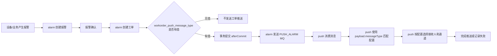

# 工单推送联合测试计划

## 目标

验证报警确认创建工单后，`alarm` 服务能按 `alarm_configure.workorder_push_message_type` 生成工单创建推送消息，`push` 服务能按消息内 `messageType` 匹配推送配置，并由 push 配置决定接收人和推送通道。

本计划只覆盖第一版“工单创建推送”。转派、退回、完成、关闭等工单状态变化推送不在本轮验收范围内。

## 当前设计口径

- `alarm_configure.push_message_type` 只表示报警产生后的报警推送业务类型。
- `alarm_configure.workorder_push_message_type` 只表示报警创建工单后的工单推送业务类型。
- `workorder_push_message_type` 为空时，报警确认创建工单后不发送工单推送。
- alarm 只保存业务类型编码，不决定推给谁、不决定用什么通道。
- push 负责维护业务枚举、推送配置、接收人规则和通道规则。
- 工单创建推送继续发送到现有 `PUSH_ALARM` 队列。
- push 必须优先使用消息 payload 内的 `messageType`，不能用默认报警类型覆盖工单类型。

## 测试范围

### alarm 侧

验证点：

- 报警配置新增字段 `workorder_push_message_type` 能保存、修改、查询。
- `selectEnabledForAlarm` 能返回 `workorder_push_message_type`。
- 创建工单成功后，若 `workorder_push_message_type` 有值，在事务提交后发送推送消息。
- `workorder_push_message_type` 为空时，不发送工单推送。
- `push.open=false` 时，不发送工单推送。
- 工单创建失败或重复创建失败时，不发送工单推送。
- MQ 发送异常只记录日志，不回滚工单创建。

### push 侧

验证点：

- push 消费 `PUSH_ALARM` 队列消息时读取 payload 顶层 `messageType`。
- `messageType=25` 能匹配 push 侧工单推送配置。
- push 根据自身配置决定接收人。
- push 根据自身配置决定通道，例如站内信、短信、电话、企业微信等。
- push 不再把工单推送消息强制覆盖成报警默认推送类型。
- 未配置 `messageType=25` 时，push 有明确日志或失败记录，不影响 MQ 消费稳定性。

### 联合链路

完整链路：



## 测试环境准备

### 基础服务

需要启动：

- MySQL
- RabbitMQ
- Nacos
- hpis-alarm
- hpis-push

建议先确认队列：

- `PUSH_ALARM` 存在。
- alarm 能正常发送到 RabbitMQ。
- push 能正常消费 `PUSH_ALARM`。

### alarm 配置准备

确认 `alarm_configure` 已存在字段：

```sql
show columns from alarm_configure like 'workorder_push_message_type';
```

准备一条开启报警、可创建工单的报警配置：

```sql
update alarm_configure
set push_enabled = '1',
    push_message_type = '22',
    workorder_push_message_type = '25',
    workorder_config_id = 900
where alarm_configure_id = ${alarmConfigureId};
```

说明：

- `push_message_type=22` 表示报警推送业务类型。
- `workorder_push_message_type=25` 表示报警工单推送业务类型。
- `${alarmConfigureId}` 替换为实际报警配置 ID。
- `workorder_config_id` 替换为实际可用的工单模板或工单配置 ID。

### push 配置准备

push 侧需要至少配置一个 `messageType=25` 的推送配置。

配置要求：

- 业务类型：`25`
- 业务含义：报警工单创建推送
- 接收人规则：使用测试账号或测试用户组
- 推送通道：至少启用一个可观测通道
- 推送内容模板：能展示 `deviceSn`、`alarmId`、`workorderId` 或 `workorderNo`

同时建议保留 `messageType=22` 的报警推送配置，用于验证报警推送和工单推送不会互相抢配置。

## alarm 自动化测试

从父工程执行：

```powershell
cd D:\studyProject\hpis2.0\hpis

mvn -pl hpis-alarm -am "-Dtest=AlarmWorkorderServiceImplTest,AlarmWorkorderMapperXmlContractTest,AlarmServicePushFilterTest" "-DfailIfNoTests=false" "-Dfile.encoding=UTF-8" test
```

通过标准：

- `AlarmWorkorderServiceImplTest` 通过。
- `AlarmWorkorderMapperXmlContractTest` 通过。
- `AlarmServicePushFilterTest` 通过。
- 无编译错误。

当前 alarm 侧已覆盖的重点用例：

| 用例 | 期望 |
| --- | --- |
| `workorderPushMessageType=25` 且工单创建成功 | after-commit 发送 `messageType=25` |
| `workorderPushMessageType=null` | 不发送工单推送 |
| `push.open=false` | 不发送工单推送 |
| `DuplicateKeyException` | 不发送工单推送 |
| payload 字段检查 | 包含 `tenantId/deviceSn/alarmId/workorderId/workorderNo/workorderConfigId/status/data.eventType` |

## push 修改后的自动化测试建议

push 修改后，至少补以下测试。

### 消息类型解析测试

输入消息：

```json
{
  "messageType": "25",
  "tenantId": 10,
  "deviceSn": "DEV-1",
  "alarmId": 200,
  "workorderId": 300,
  "workorderNo": "WO-200",
  "workorderConfigId": 900,
  "status": "0",
  "data": {
    "eventType": "ALARM_WORKORDER_CREATED"
  }
}
```

期望：

- push 解析出的业务类型是 `25`。
- 不被默认报警推送类型覆盖。
- 能匹配 `messageType=25` 的推送配置。

### 配置路由测试

准备两套 push 配置：

| messageType | 含义 | 接收人 | 通道 |
| --- | --- | --- | --- |
| `22` | 紧急报警推送 | A 用户 | 报警通道 |
| `25` | 报警工单推送 | B 用户 | 工单通道 |

输入 `messageType=25` 的工单推送消息。

期望：

- 只命中 `25` 配置。
- 不命中 `22` 配置。
- 接收人为 B 用户。
- 通道为工单通道。

### 缺失配置测试

删除或禁用 `messageType=25` 的 push 配置。

期望：

- push 不误用 `22`。
- push 有明确日志或失败记录。
- MQ 消费线程稳定，不出现无限异常重试。

## 联合手工测试用例

### Case 1：工单推送成功

前置条件：

- alarm 配置 `push_enabled='1'`。
- alarm 配置 `push_message_type='22'`。
- alarm 配置 `workorder_push_message_type='25'`。
- alarm 配置绑定有效 `workorder_config_id`。
- push 配置存在 `messageType=25`。

步骤：

1. 产生一条命中该报警配置的报警。
2. 确认报警，并触发创建工单。
3. 查看 `alarm_workorder` 是否生成工单。
4. 查看 alarm 日志是否发送工单推送消息。
5. 查看 RabbitMQ `PUSH_ALARM` 是否有消费记录。
6. 查看 push 日志是否按 `messageType=25` 匹配配置。
7. 查看测试接收人是否收到工单推送。

期望：

- 工单创建成功。
- alarm 发送的消息顶层 `messageType=25`。
- push 命中 `25` 配置。
- 接收人和通道来自 push 的 `25` 配置。
- 报警推送 `22` 和工单推送 `25` 不互相覆盖。

### Case 2：未绑定工单推送类型

前置条件：

```sql
update alarm_configure
set workorder_push_message_type = null
where alarm_configure_id = ${alarmConfigureId};
```

步骤：

1. 产生报警。
2. 确认报警并创建工单。
3. 查看工单是否创建成功。
4. 查看 alarm 是否发送工单推送 MQ。

期望：

- 工单创建成功。
- 不发送工单推送 MQ。
- push 不收到工单推送消息。

### Case 3：push 开关关闭

前置条件：

- alarm 服务配置 `push.open=false`。
- `workorder_push_message_type='25'`。

步骤：

1. 产生报警。
2. 确认报警并创建工单。
3. 查看工单是否创建成功。
4. 查看是否发送工单推送。

期望：

- 工单创建成功。
- 不发送工单推送。

### Case 4：push 侧未配置 25

前置条件：

- alarm 配置 `workorder_push_message_type='25'`。
- push 侧删除或禁用 `messageType=25` 配置。

步骤：

1. 产生报警。
2. 确认报警并创建工单。
3. 查看 alarm 是否发送 `messageType=25` 消息。
4. 查看 push 消费和路由结果。

期望：

- alarm 正常创建工单并发送消息。
- push 不误用 `22` 配置。
- push 记录未匹配配置或不可推送原因。
- MQ 消费稳定。

### Case 5：报警推送与工单推送共存

前置条件：

- alarm 配置 `push_message_type='22'`。
- alarm 配置 `workorder_push_message_type='25'`。
- push 侧同时配置 `22` 和 `25`。

步骤：

1. 产生报警。
2. 观察报警产生后的报警推送。
3. 确认报警并创建工单。
4. 观察工单创建后的工单推送。

期望：

- 报警产生后使用 `22`。
- 工单创建后使用 `25`。
- 两条消息能分别命中不同 push 配置。
- 两类推送可配置不同接收人和不同通道。

## 联合测试日志检查点

### alarm 日志

重点查：

- 创建工单成功日志。
- 工单推送发送日志。
- 发送失败时的错误日志。
- `workorderPushMessageType` 为空时不应出现发送日志。

### RabbitMQ

重点查：

- `PUSH_ALARM` 队列消息是否被投递。
- 消息是否被 push 消费。
- 是否存在异常堆积或死信。

### push 日志

重点查：

- 接收到的原始 payload。
- 解析出的 `messageType`。
- 命中的 push 配置 ID。
- 解析出的接收人。
- 使用的通道。
- 推送成功或失败结果。

## 验收标准

本轮联合测试通过需要同时满足：

- alarm 自动化测试通过。
- push 自动化测试通过。
- 工单创建成功后，`messageType=25` 能进入 push。
- push 使用 `messageType=25` 匹配工单推送配置。
- push 接收人和通道完全由 push 配置决定。
- `workorder_push_message_type` 为空时不发送工单推送。
- `push.open=false` 时不发送工单推送。
- 工单创建失败时不发送工单推送。
- push 未配置 `25` 时不误用 `22`。
- 报警推送 `22` 和工单推送 `25` 能并存且互不影响。

## 回归测试范围

联合测试完成后，建议回归：

- 普通报警创建。
- 报警推送过滤。
- 报警确认。
- 报警确认但不创建工单。
- 报警确认并创建工单。
- 重复确认报警。
- 重复创建工单防重。
- push 原有报警推送类型。
- push 原有非报警业务类型。

## 风险点

- push 如果仍从固定配置读取报警默认类型，会导致 `25` 被覆盖。
- push 如果只读取嵌套 `data.messageType`，会读不到当前 payload 顶层 `messageType`。
- push 如果把所有 `PUSH_ALARM` 队列消息都视为报警推送，会导致工单推送误命中报警配置。
- alarm 当前第一版没有 outbox/retry，MQ 发送失败只记录日志。
- `workorder_push_message_type` 为空表示不推送，测试数据不要误填空字符串后再用 SQL 只判断 `is null`。

## 问题定位顺序

联调失败时按以下顺序排查：

1. `alarm_configure.workorder_push_message_type` 是否有值。
2. 工单是否真实创建成功。
3. alarm 是否开启 `push.open`。
4. alarm 是否向 `PUSH_ALARM` 发送消息。
5. RabbitMQ 是否收到消息。
6. push 是否消费到消息。
7. push 是否读取 payload 顶层 `messageType`。
8. push 是否存在 `messageType=25` 的有效配置。
9. push 是否解析出正确接收人。
10. push 通道是否发送成功。
